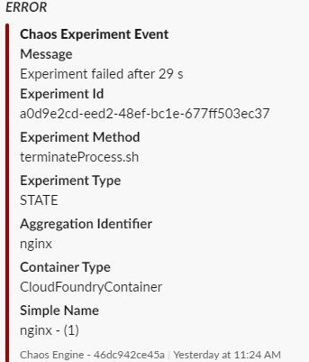
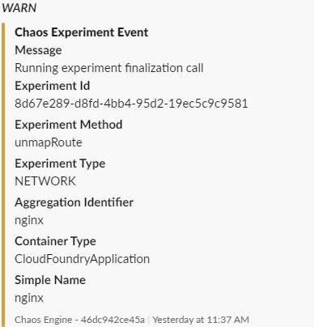
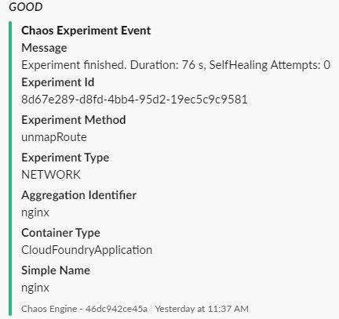
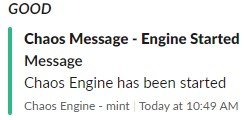
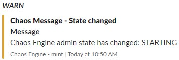

# Slack Notifications

## Description

Notify team members of running experiments. The Chaos Engine generates two types of notifications:

- Chaos Experiment Event - generated during experiment lifecycle
- Chaos Message - general notifications 

!!! Note
    Slack notifications are buffered. The buffer is flushed every minute or when buffer size reaches 20 items.
    
### Chaos Experiment Event Structure

| Field | Description | Example Value |
| --- | --- | --- |
| Header | Event Prefix | Chaos Experiment Event |
| Notification Level | Event severity | ERROR, WARN, GOOD
| Message | Event description | Starting new experiment |
| Experiment ID | UUID of an experiment | 505ec298-d4c6-4be0-b209-7f4aae78b359 |
| Experiment Method | Experiment implementation | nullRoute.sh |
| Experiment Type | Type of an experiment | state, resource, network |
| Aggregation Identifier | Resource group identifier | nginx (k8s deployment name)|
| Container Type | Type of targeted container | CloudFoundryContainer, KubernetesPodContainer,.. |
| Simple Name | Container simple name |  ngnix-hm5d2 (k8s container name)  |

#### Chaos Experiment Event Examples

| ERROR | WARN | GOOD |
| --- | --- | --- |
|  ||  |

### Chaos Message Structure

| Field | Description | Example Value |
| --- | --- | --- |
| Header | Event prefix | Chaos Message |
| Message | General notice | Chaos Engine has been started |

#### Chaos Message Examples

| GOOD | WARN |
| --- | --- |
|  || 

     
## Configuration

Configure a Slack Webhook and provide the URI as an argument.

| Variable | Description | Default |
| --- | --- | --- |
| slack_webhookuri | Web Hook URI for pushing to Slack. | None |

For more details see [webhook creation manual](https://api.slack.com/incoming-webhooks)

### Development notes

#### Slack API Documentation

- [Message Formatting](https://api.slack.com/docs/message-formatting)
- [Message Attachments](https://api.slack.com/docs/message-attachments)
- [Message Builder](https://api.slack.com/docs/messages/builder?msg=%7B%22attachment)