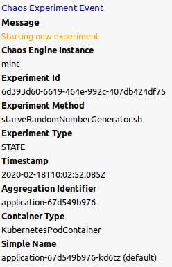
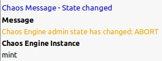

# XMPP Notifications

## Description

The Chaos Engine can send XMPP notifications to multiple public chat rooms or it could send private messages to multiple registered users.

The Chaos Engine generates two types of notifications:

- Chaos Experiment Event - generated during experiment lifecycle
- Chaos Message - general notifications 

    
### Chaos Experiment Event Structure

| Field | Description | Example Value |
| --- | --- | --- |
| Header | Event Prefix | Chaos Experiment Event |
| Message | Event description | Starting new experiment |
| Chaos Engine Instance | Hostname or IP of a Chaos Engine instance which generated the event | chaos.engine.com |
| Experiment ID | UUID of an experiment | 505ec298-d4c6-4be0-b209-7f4aae78b359 |
| Experiment Method | Experiment implementation | nullRoute.sh |
| Experiment Type | Type of an experiment | state, resource, network |
| Aggregation Identifier | Resource group identifier | nginx (k8s deployment name)|
| Container Type | Type of targeted container | CloudFoundryContainer, KubernetesPodContainer,.. |
| Simple Name | Container simple name |  ngnix-hm5d2 (k8s container name)  |

#### Chaos Experiment Event Examples

| ERROR | WARN | GOOD |
| --- | --- | --- |
|  ||  |

### Chaos Message Structure

| Field | Description | Example Value |
| --- | --- | --- |
| Header | Event prefix | Chaos Message |
| Message | General notice | Chaos Engine has been started |
| Chaos Engine Instance | Hostname or IP of a Chaos Engine instance which generated the event | chaos.engine.com |

#### Chaos Message Examples

| GOOD | WARN |
| --- | --- |
|  || 

     
## Configuration
 | Variable | Description | Example Value | Default |
 | --- | --- | --- | --- |
 | xmpp.enabled | Enables XMPP notification module | true / false | false |
 | xmpp.user | JID of an account to be used by the Engine | chaos@jabber.com | None |
 | xmpp.password | Password of an account to be used by the Engine |  | None |
 | xmpp.domain | XMPP domain  | chaos.jabber.com | None |
 | xmpp.hostname | XMPP server hostname | jabber.com | None | 
 | xmpp.serverCertFingerprint | XMPP server certificate fingerprint used for [Java Pinning](https://github.com/Flowdalic/java-pinning) | CERTSHA256:F9:16:59:0B:93:72:66:A4:9A:DB:DF:2A:7F.... | None |
 | xmpp.conferenceRooms | Comma separated list of chat rooms where to post notifications | chaos@conference.jabber.com, infra@conference.jabber.com | None |
 | xmpp.recipients | Comma separated list of individual users to be notified | bob@jabber.com, eva@jabber.com | None |
 