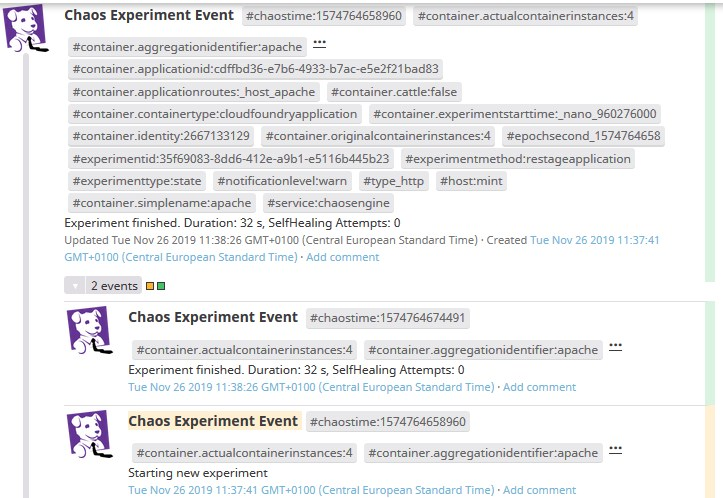
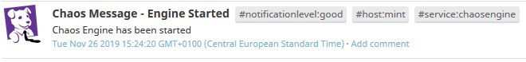
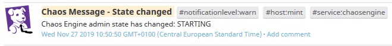

# Datatog Events

## Description

The Chaos Engine can feed all notifications to DataDog. All the events can be analyzed and post-process in [DataDog's event stream](https://app.datadoghq.com/event/stream). The event stream and information in Chaos Engine logs can be correlated with platform metrics, raised alerts, app logs and it helps to build overall picture of experiment execution as well as platform health.

### Datatog Event 

There are two types of events which differs event title:

- Chaos Experiment Event - generated during experiment lifecycle
- Chaos Message - general notifications 

Every Event consists of title (Chaos Event prefix + experiment method or Chaos Message depending on type), message (detailed description of an event, see Chaos Event Types) and set of tags.
Following tags are assigned to each event:

#### Chaos Experiment Event Structure

!!! Note
    Chaos Experiment Events are grouped in DataDog stream by experiment ID

| Field | Description | Example Value |
| --- | --- | --- |
| Title | Title composed of `Chaos Message` prefix + `detail suffix` | Chaos Message - Engine Started |
| Message | General Notice | Chaos Engine has been started |

| Tag | Description | Example Value |
| --- | --- | --- |
| notificationlevel | Event severity | ERROR, WARN, GOOD |
| experimentid | UUID of an experiment | 505ec298-d4c6-4be0-b209-7f4aae78b359 |
| experimenttype | Type of an experiment | state, resource, network | 
| experimentmethod | Experiment implementation | nullRoute.sh |
| container.aggregationidentifier | Resource group identifier | nginx (k8s deployment name)|
| container.name | Container simple name |  ngnix-hm5d2 (k8s container name)  |
| host | hostname or IP of the Chaos Engine instance which produced the message | example.com |
| service | Static identifier of Chaos Engine generated events | chaosengine |

##### Chaos Experiment Events Example

        
#### Chaos Message Structure

| Field | Description | Example Value |
| --- | --- | --- |
| Title | Static title | Chaos Experiment Event |
| Message | General Notice | Starting new experiment  |

| Tag | Description | Example Value |
| --- | --- | --- |
| notificationlevel | | GOOD |
| host | hostname or IP of the Chaos Engine instance which produced the message | example.com |
| service | Static identifier of Chaos Engine generated events | chaosengine |

##### Chaos Message Examples

| Severity | Message |
| --- | --- |
| GOOD |  |
| WARN |  |
