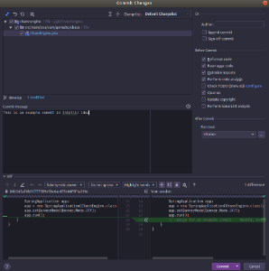

# Developer Documentation

This documentation is provided to help ensure that new contributions to the Chaos Engine project can easily ramp up, and follow similar standards to avoid Version Control merging issues.

## Required Tools
| Tool | Description | Download |
| --- | --- | --- |
| Git | Version Control Software | https://git-scm.com/downloads |
| OpenJDK | Java Development Kit | https://openjdk.java.net/install/ | 
| Maven | Java dependency manager | https://maven.apache.org/install.html |
 | IntelliJ IDEA | Development Environment | https://www.jetbrains.com/idea/ | 
| Docker | Local deployment and testing in containers | https://docs.docker.com/install/ |
| Docker-Compose | Local deployment for testing container with microservice dependencies | https://docs.docker.com/compose/install/ |

## Version Control

### Git

Chaos Engine is managed in the [Gemalto GitHub](https://github.com/gemalto/chaos-engine) repository.

#### Protected Branches

The **master** and **develop** branches should not have direct pushes. All work should be done in sub-branches and managed through Pull Requests. Pull requests should be reviewed by a person in the Thales Chaos Engine team.

## IDE

### IntelliJ IDEA

IntelliJ IDEA is the IDE of choice for Chaos Engine development. The IDE can be downloaded from [here](https://www.jetbrains.com/idea/).

### Code Style

Code Style formatting is included for IntelliJ as part of the Git Repository. You should ensure that before committing code, IntelliJ performs the **Reformat Code**, **Rearrange Code**, **Optimize Imports**, and **Cleanup** operations. These are all available in the Code Commit dialog. These operations ensure that code formatting is consistent for everyone using the IDE, reducing the complexity of Merge operations.

### Coding Conventions

See [Chaos Engine Coding Conventions](coding_conventions.md)

## Alternatives

Other IDE's may be used. However, care should be taken to ensure that the Code Style used in IntelliJ is mapped identically to other IDE's, to prevent potential merge issues.

## Local Testing

### Docker

A Dockerfile has been made for building the Chaos Engine in a consistent manner. This Dockerfile ensures that the version run on your local machine should be equivalent to one built by pipelines.

### Docker-Compose

A docker-compose.yml file has been included in the root of the project for easy testing with dependencies. Any additional Dockerfiles will be in the developer-tools folder and should have an associated README.
